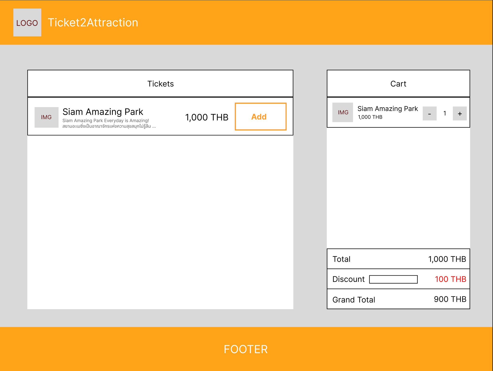

# INTERVIEW TEST

## Introduce

The client is rushing to launch new project on next week, The backend team is on vacation at Ibiza beach, that's why you are the only one who can saves the day!.

## Problems

- We implementing a checkout page
- Create a list of ticket and cart checkout
- You can refactor anyway you want
- you only have API mock, So you need to create API Server also.
- Try to build reusable hook for delegate between mock and API.

## Requirements

- As a user, I want to see list of ticket
- As a User, I want to pick many tickets as I want
- As a User, I want to update quantity of each ticket in cart
- As a User, I want to see total amount of the cart
- As a User, I want to refresh the page and the cart is not reset
- As a User, I want to apply a discount coupon
- (Optional) As a user, I want to search ticket by title
- (Optional) As a user, I want to sorting ticket by price, title

## Wireframe

- Have Tickets Component on the left and Cart Component on the right
  

## Nice to Have

- Unit Tests
- Component reusable

## Project Submission

- Clone this respository and create your own git (gitlab/github)
- Reply email with git url
